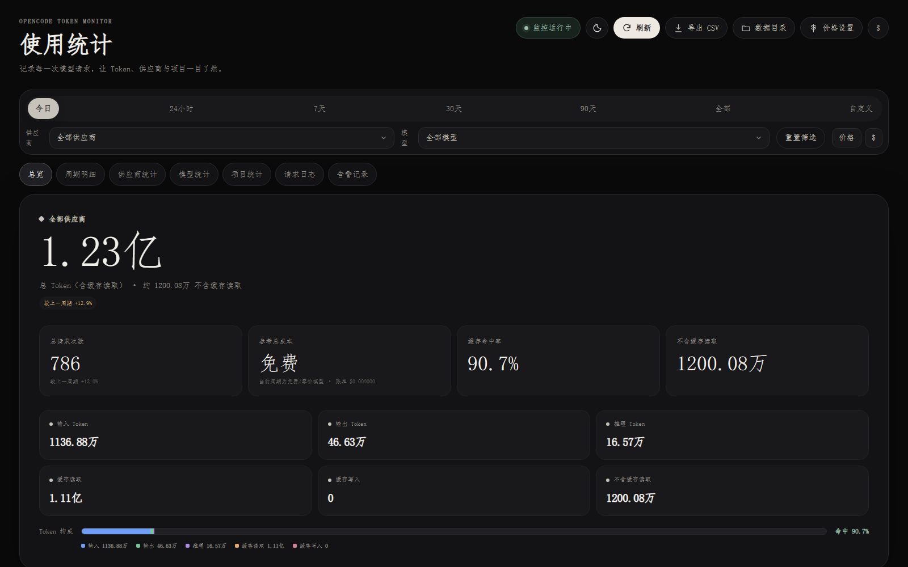
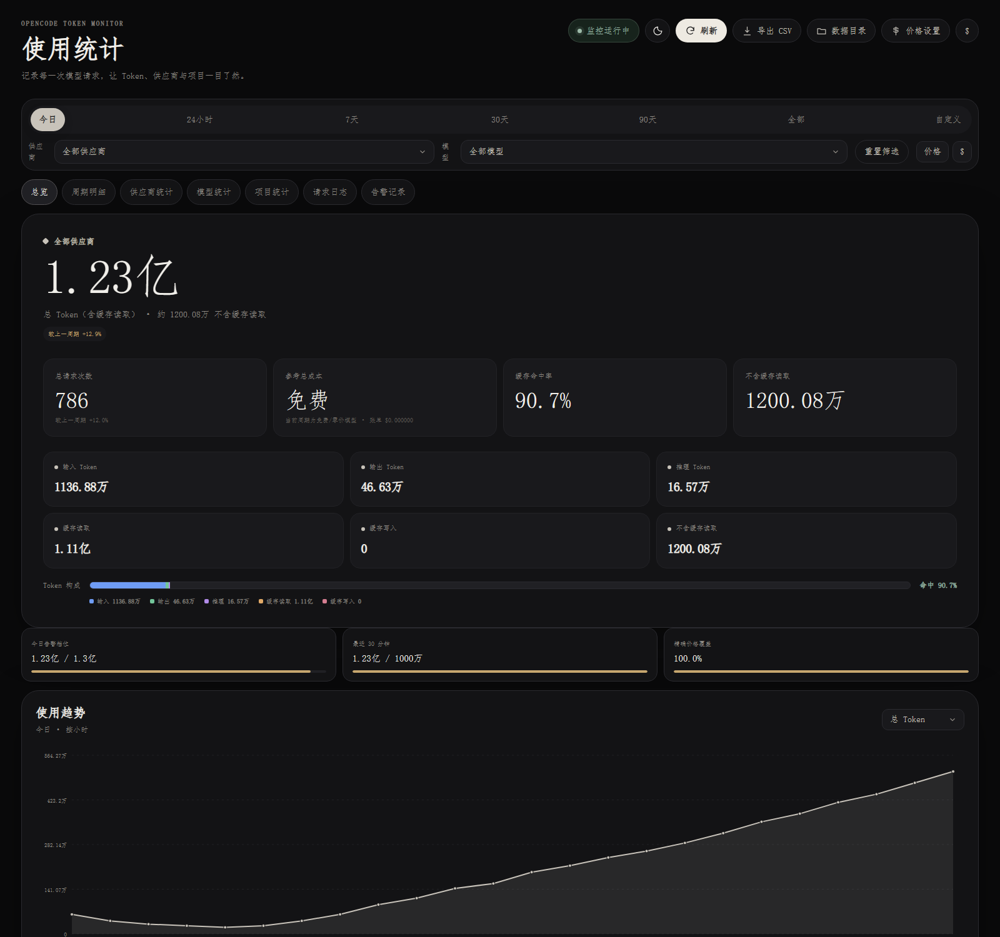
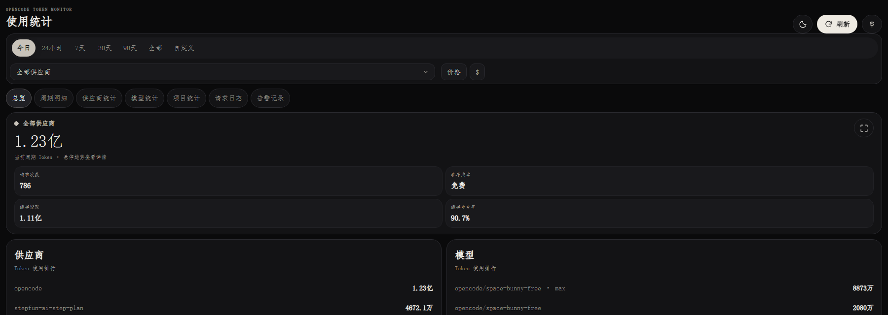
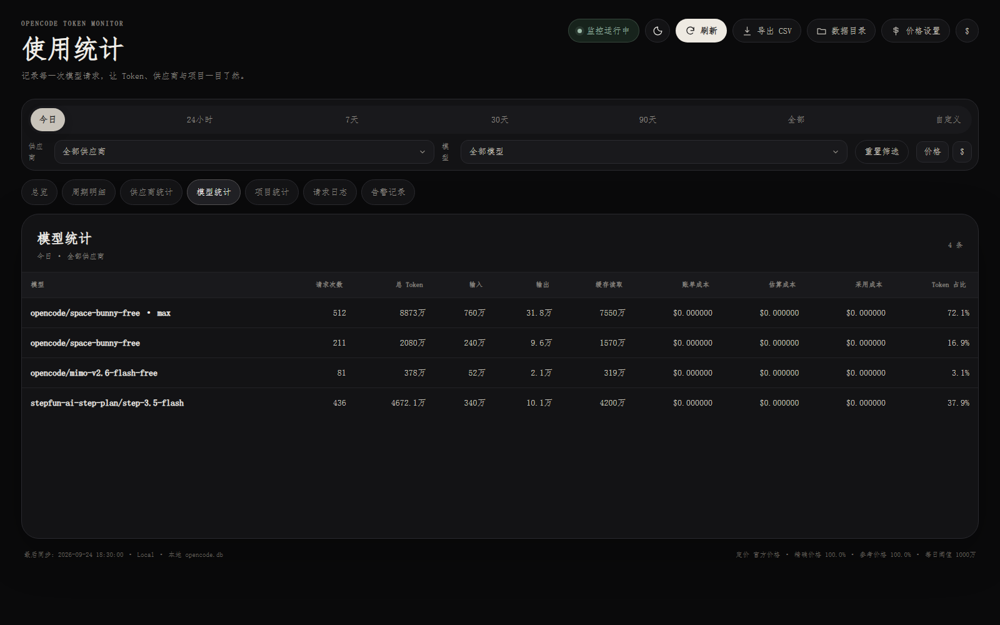
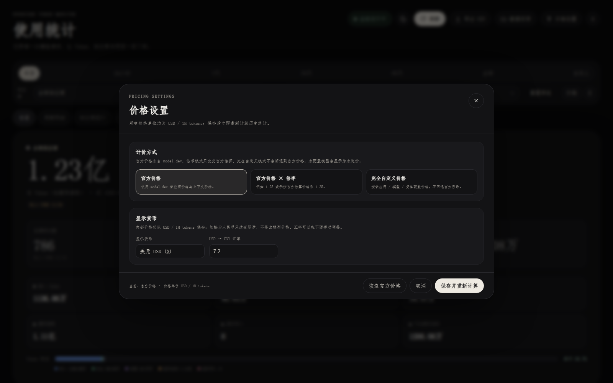

<div align="center">

# Agent Token Monitor

### 面向多个 AI 编码 Agent 的本地 Token 用量仪表盘

**不拿 API Key，不上传会话，不猜额度。** 只在本机 Agent 运行时读取它们已经保存的本地数据，把每一次模型请求变成可追溯的 Token、缓存和成本统计。

[](https://github.com/ausyeah/agent-token-monitor/releases/latest)
[](https://learn.microsoft.com/microsoft-edge/webview2/)
[](LICENSE)
[](https://github.com/ausyeah/agent-token-monitor/releases/latest)

</div>

---

## 同时统计哪些 Agent

| Agent | 读取位置 | Token 口径 |
| --- | --- | --- |
| **OpenCode** | `~/.local/share/opencode/opencode.db` | 供应商事件中的 token 字段 |
| **WorkBuddy** | `~/.workbuddy/projects/**/*.jsonl` | `providerData.rawUsage` 原始计数器 |
| **DeepSeek Harness** | `~/.dsh/sessions/**/*.jsonl.zstd` | `assistant/message` 的 `usage` |

Dashboard 顶部的「来源」下拉可在这三者之间切换；只有一个来源时该控件自动隐藏。

> WorkBuddy 用积分（Credit）计费且无法换算成 Token 比例，DeepSeek Harness 不记录缓存命中与成本。本工具只呈现各 Agent 真实记录的字段，不做任何推算。

## 为什么做这个工具？

用 AI 编码 Agent 最缺的往往不是“再看一个聊天窗口”，而是回答这些问题：

- 今天到底用了多少 **Token**？其中多少是缓存读取？
- 各个 **Agent**、**模型 / 供应商**分别贡献了多少？
- 最近 30 分钟是否突然出现用量尖峰？
- 免费模型的成本显示为 `0`，是否真的等于“没有使用量”？
- 如果账单缺失，参考价格和实际账单到底差多少？

Agent Token Monitor 把多个 Agent 的本地用量记录整理成一个长期、可搜索、可导出的 Windows 桌面仪表盘。

> **重要说明**：这是本地用量统计工具，不是任何 Agent 或云平台的官方配额面板。它不会读取账号剩余额度，也不会绕过任何服务端限制；它展示的是本机已记录的请求用量。model.dev 价格仅用于缺失账单时的本地估算。

### 各来源的口径差异

WorkBuddy 用积分（Credit）计费，同一模型下不同任务的 Credit / Token 比值差异极大，但它自己会为每次请求记录**供应商原始的 token 计数器**，因此本工具拿到的是真实 Token 数量而非对 Credit 的猜测。

DeepSeek Harness 的会话日志是 zstd 压缩且会被原地重写，所以不使用字节偏移游标，而是每次解压后按 `会话 id + 事件序号` 幂等入库。

| 项目 | WorkBuddy | DeepSeek Harness |
| --- | --- | --- |
| 输入 Token | `prompt_cache_miss_tokens`（不含已缓存前缀） | `inputTokens` |
| 缓存命中 | `prompt_cache_hit_tokens` | 无此字段，记为 0 |
| 输出 Token | `completion_tokens - completion_thinking_tokens` | `outputTokens` |
| 推理 Token | `completion_thinking_tokens`（输出的子集，拆分为互斥两项） | 无独立字段，不拆分 |
| 成本 | Credit 不折算金额 | 无成本字段 |
| 供应商 / 模型 | `providerData.requestModelId` | 每次请求的 `finish.replayState.response` 路由，优先于会话级设置 |

> DeepSeek Harness 的会话日志是 zstd 压缩且会被原地重写，因此不使用字节偏移游标，而是每次解压后按 `会话 id + 事件序号` 幂等入库，重复同步不会产生重复记录。缺少 `zstandard` 依赖时会在界面上明确提示，而不是静默显示为零。

## 功能亮点

### 看见真实的使用量，而不只是 `$0.00`

- 统计 **请求次数**、输入、输出、推理、缓存命中
- 同时显示“含缓存命中”和“不含缓存”两种口径
- Token 构成使用多色堆叠条：输入、输出、推理、缓存命中一眼可区分
- 悬停查看每一类的数量与占比，图例同步显示数值
- 账单成本、参考估算、采用成本、未定价状态分开显示，绝不把估算伪装成账单

### 适合免费计划的长期观察

- 今日、最近 24 小时、7 天、30 天、90 天、全部、自定义日期
- 供应商 / 模型 / 变体级筛选
- 周期趋势、供应商排行、模型排行、项目统计
- 今日每跨过一个 10M Token 档位提醒
- 最近 30 分钟达到突增阈值时提醒
- 托盘颜色、声音通知、开机启动和每日告警记录

### 为本地数据工作而设计

- OpenCode 未运行时**不会查询源数据库**
- 只读访问本机 `opencode.db`，工具自己的统计数据保存在独立数据库
- 后台同步与 Dashboard 刷新分离，退出 OpenCode 后自动停止后续源库查询
- 请求日志单次返回最近 100 条，避免 WebView2 Bridge 数据长度超限
- 永久历史、CSV 流水、价格来源和匹配状态均可导出

### 成本与显示方式可配置

- 官方价格：使用 [model.dev](https://models.dev/) 供应商价格与上下文阶梯
- 官方价格 × 全局倍率：适合按组织规则调整参考估算
- 完全自定义价格：按供应商 / 模型 / 变体设置五类 Token 单价
- USD / CNY 一键切换；默认汇率 `1 USD = 7.20 CNY`，可编辑
- 内部历史和 CSV 始终保存 USD，汇率只影响显示

## 截图

> 截图使用脱敏的代表性数据生成，展示了产品界面和交互，不包含本机用户名、API Key 或完整数据库路径。

### 总览：免费计划也能看清真实用量



总览同时给出请求次数、含缓存命中总 Token、不含缓存 Token、缓存命中率和成本状态。底部堆叠条把输入、输出、推理、缓存命中分别显示出来。

### 趋势与告警



长时间范围自动切换为按天趋势，Dashboard 还会显示今日档位、最近 30 分钟突增和精确价格覆盖率。

### 紧凑窗口也不丢关键数据



窗口较矮或较窄时自动进入紧凑布局，供应商和模型排行并排出现，核心数值仍然优先可见。

### 模型级别统计



模型统计页可以快速比较不同模型 / 变体的请求次数、Token 构成、缓存命中和成本来源。

### 价格设置



官方价格、倍率价格、完全自定义价格三种模式在同一窗口切换；所有自定义价格单位均为 `USD / 1M tokens`。

## 快速开始

### 下载已打包版本

从 [Releases](https://github.com/ausyeah/agent-token-monitor/releases/latest) 下载 `AgentTokenMonitor-*-windows-x64.exe`：

1. 双击 EXE 安装到 `%LOCALAPPDATA%\\Programs\\AgentTokenMonitor`
2. 启动 Dashboard
3. 托盘模式会在后台同步；也可以使用桌面快捷方式直接打开 Dashboard

程序不会要求你把 `oc_sk_` 或其他 OpenCode API Key 填入配置。它只读取本机 OpenCode 已经产生的数据。

### 从源码构建

需要 Windows、Python 3.13+ 和 Microsoft Edge WebView2 Runtime：

```powershell
git clone https://github.com/ausyeah/agent-token-monitor.git
cd agent-token-monitor
python -m pip install -r requirements.txt
.\build.ps1
```

构建产物：

```text
dist\AgentTokenMonitor.exe
```

安装并保留已有配置：

```powershell
.\install.ps1
```

只安装、不立即启动托盘：

```powershell
.\install.ps1 -NoStart
```

运行测试：

```powershell
python -m unittest discover -s tests -q
```

## 使用方法

### Dashboard

启动后可以查看：

- **总览**：总量、请求次数、成本、缓存构成、趋势、供应商和模型排行
- **周期明细**：按小时 / 按天查看每个时间桶
- **供应商统计**：按供应商聚合
- **模型统计**：按供应商、模型、变体聚合
- **项目统计**：按项目聚合
- **请求日志**：搜索、排序最近请求，查看请求详情抽屉
- **告警记录**：每日档位、突增、错误和恢复记录

### 命令行

```text
AgentTokenMonitor.exe dashboard
AgentTokenMonitor.exe tray
AgentTokenMonitor.exe status
AgentTokenMonitor.exe status --json
AgentTokenMonitor.exe history --days 30
AgentTokenMonitor.exe sync
AgentTokenMonitor.exe export
AgentTokenMonitor.exe paths
AgentTokenMonitor.exe test-alert
AgentTokenMonitor.exe install
AgentTokenMonitor.exe uninstall
```

不传参数或传入 `tray` 时启动托盘模式。

## 数据与隐私

默认数据目录：

```text
%LOCALAPPDATA%\\AgentTokenMonitor
```

从 v3.x（`%LOCALAPPDATA%\\OpenCodeTokenMonitor`）升级时，历史统计、价格配置与 CSV 会在首次启动时自动迁移，无需手动操作。

主要文件：

| 文件 | 用途 |
| --- | --- |
| `monitor.db` | 工具自己的永久统计数据库 |
| `config.json` | 本地配置与价格设置 |
| `monitor.log` | 运行日志 |
| `models.dev.all.json` | model.dev 价格目录缓存 |
| `csv\\usage_events.csv` | 每次模型请求的最终用量 |
| `csv\\usage_ledger.csv` | Token 变化流水 |
| `csv\\daily_summary.csv` | 按天汇总 |
| `csv\\provider_summary.csv` | 按天 + 供应商汇总 |
| `csv\\model_summary.csv` | 按天 + 供应商 + 模型汇总 |
| `csv\\project_summary.csv` | 按天 + 项目汇总 |
| `csv\\pricing_estimates.csv` | 账单、估算、价格来源与匹配状态 |

源数据库只读访问：

```text
%USERPROFILE%\\.local\\share\\opencode\\opencode.db
%USERPROFILE%\\.workbuddy\\projects\\**\\*.jsonl
%USERPROFILE%\\.dsh\\sessions\\**\\session.v*.jsonl.zstd
```

程序会先检测 `OpenCode.exe`、`opencode.exe`、`opencode-cli.exe`、`WorkBuddy.exe` 或 `DeepSeek Harness.exe` 是否运行。只要没有任何一个在运行，就不会查询任何源数据，也不会调用 CLI 去探测路径。

配置项：

| 键 | 默认值 | 说明 |
| --- | --- | --- |
| `workbuddy_enabled` | `true` | 是否读取 WorkBuddy 本地数据 |
| `workbuddy_root` | 自动探测 | WorkBuddy 数据目录，留空则自动查找 `~/.workbuddy` |
| `dsh_enabled` | `true` | 是否读取 DeepSeek Harness 本地数据 |
| `dsh_root` | 自动探测 | DeepSeek Harness 数据目录，留空则自动查找 `~/.dsh` |

WorkBuddy 的 JSONL 为追加写入，本工具按文件大小维护增量游标，只读取新增部分；文件被截断或改写时会自动从头重读。游标与用量事件在同一事务内提交，重复同步不会产生重复记录。

### Dashboard 自动更新

Dashboard 打开期间每 20 秒检查一次本地索引是否过期，过期才触发一次同步并重绘。后台同步失败不会打断当前视图，下一次会自动重试；`Ctrl+R` 与刷新按钮仍然可用。页面重新获得焦点或从后台切回时也会立即检查一次。

只有一个数据来源时，「来源」下拉会自动隐藏，界面与单来源版本一致。

### 启动防护

Dashboard 曾经可能只显示一个黑窗口而没有任何提示。现在以下情况都会给出明确反馈：

| 情况 | 行为 |
| --- | --- |
| 内置 `dashboard.html` 缺失或被截断 | 启动前拦截，弹出错误提示并写入日志 |
| 界面脚本抛出异常 | 页面显示错误卡片，同时记录到 `monitor.log` |
| WebView 通信通道 12 秒内未就绪 | 页面显示“无法连接到后台服务”，不再空白 |
| 重复启动 Dashboard | 互斥锁保证只有一个实例，重复启动只会聚焦已有窗口 |
| 升级后旧版本窗口残留 | 启动时按进程名匹配并关闭，不影响其他程序的同名窗口 |

## 价格口径

| 显示项 | 含义 |
| --- | --- |
| 账单成本 | 供应商事件中已经写入的非零 `cost` |
| 参考估算 | 账单为零或缺失时，根据 model.dev 进行本地估算 |
| 采用成本 | 优先使用账单；账单缺失时才使用估算 |
| 未定价 | 没有可靠价格，不伪装成 `$0` |

内置价格模式：

- `official`：model.dev 官方价格
- `multiplier`：官方参考价格 × 全局倍率
- `custom`：完全自定义，不自动回退官方目录

配置示例见 [`config.example.json`](config.example.json)。

## 项目结构

```text
agent_token_monitor.py         后端、SQLite 索引、多 Agent 同步、计价、托盘、CLI、WebView2 启动
dashboard.html                  响应式 Dashboard、价格窗口、图表和交互
assets/app.ico                  应用图标
config.example.json             配置示例
install.ps1                     Windows 安装脚本
build.ps1                       PyInstaller 构建入口
AgentTokenMonitor.spec          单文件 EXE 打包配置
tests/test_monitor.py           单元测试
docs/screenshots/               README 截图
```

## 开发检查

提交前建议运行：

```powershell
python -m py_compile .\agent_token_monitor.py
python -m unittest discover -s tests -q
```

当前测试覆盖：

- OpenCode V1 / V2 数据库读取
- WorkBuddy JSONL 读取、缓存拆分与推理 Token 拆分
- DeepSeek Harness zstd 会话日志读取与逐请求路由解析
- 增量同步与去重
- 来源筛选的增量语义（空值不收窄，`opencode` 覆盖 v1/v2）
- Token 统计和 CSV
- model.dev 价格与上下文阶梯
- 官方、倍率、自定义价格
- 配置参数和进程检测
- Dashboard 启动防护：资源校验、单实例互斥、异常上报、残留窗口清理

## License

[MIT License](LICENSE)

本项目与 OpenCode、Sentinel Labs 或 Zen 计划没有隶属或背书关系。OpenCode、模型名称和相关服务归各自权利人所有。
